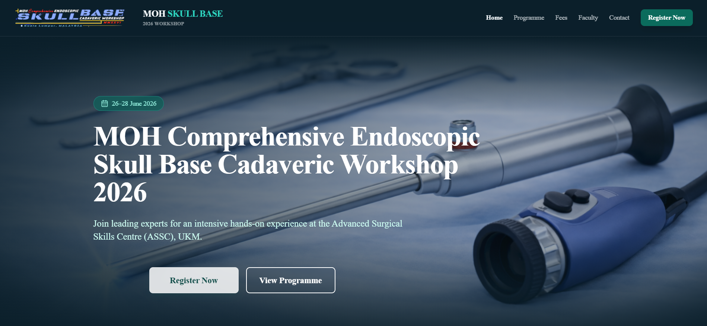

# MOH Endoscopic Skull Base Workshop Website



**Live demo:** https://moh-endoscopic-skull-base-workshop.vercel.app

Public-facing event website for the **MOH Comprehensive Endoscopic Skull Base Cadaveric Workshop 2026**.

## Purpose
This repository contains the source code for a static informational website used to share:
- Event overview and key information
- Programme details
- Faculty listing
- Fees and registration call-to-action
- Contact information

## Disclaimer
This project is intended for **public dissemination** only.
- No patient data is included.
- No confidential hospital/MOH internal documents are included.
- Logos and images used are for event/organiser/endorser identification in a public-facing context.

If any content requires removal or correction, please contact the repository owner.

## Tech Stack
- Next.js (App Router)
- TypeScript
- Tailwind CSS
- Vercel (deployment)

## Local Development
```bash
npm install
npm run dev
